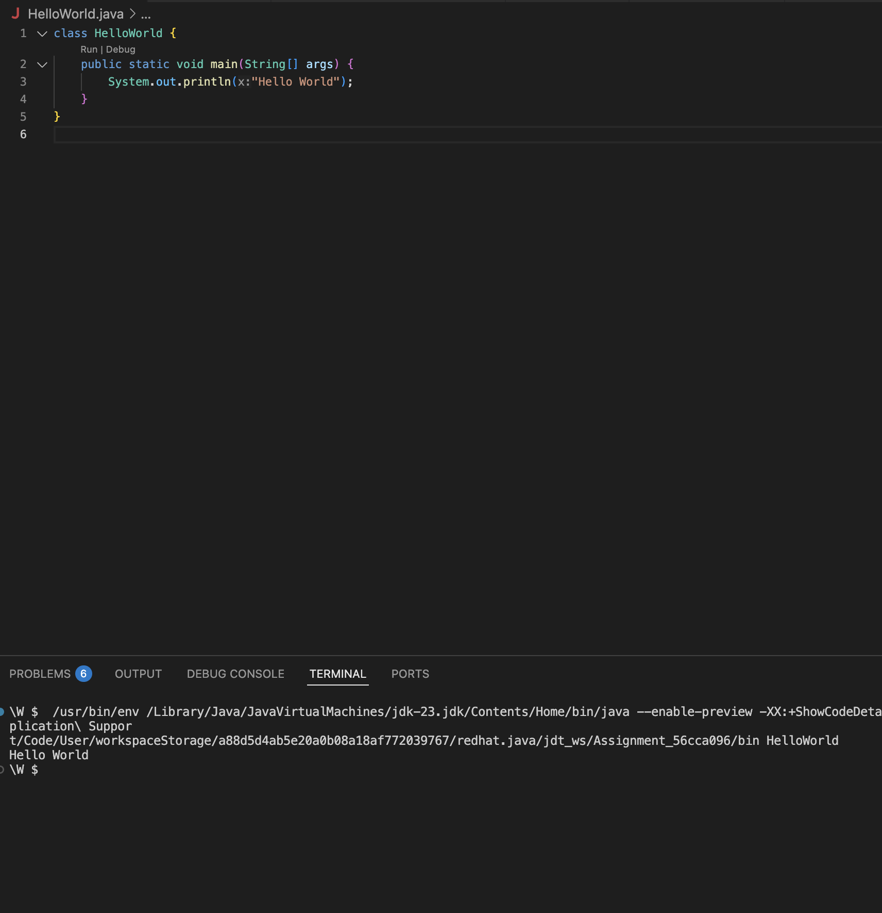
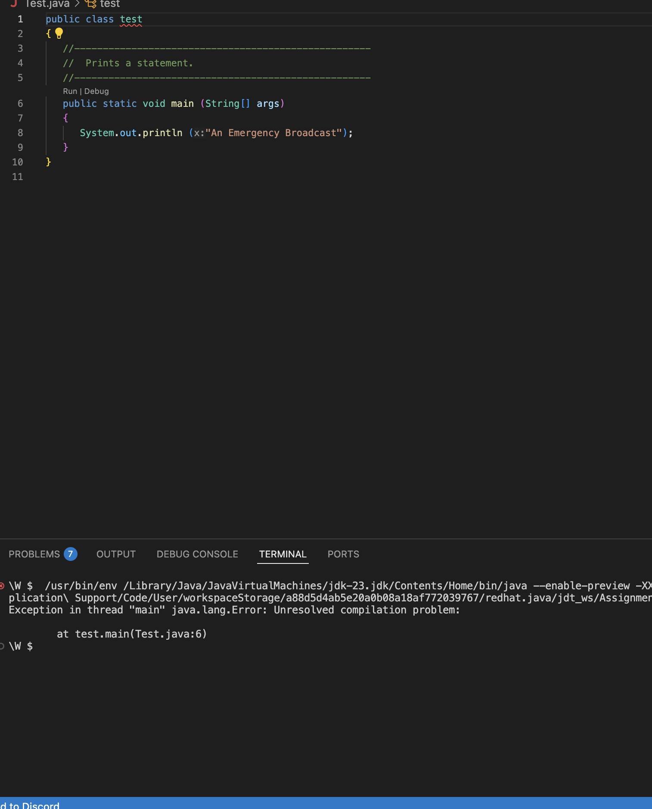
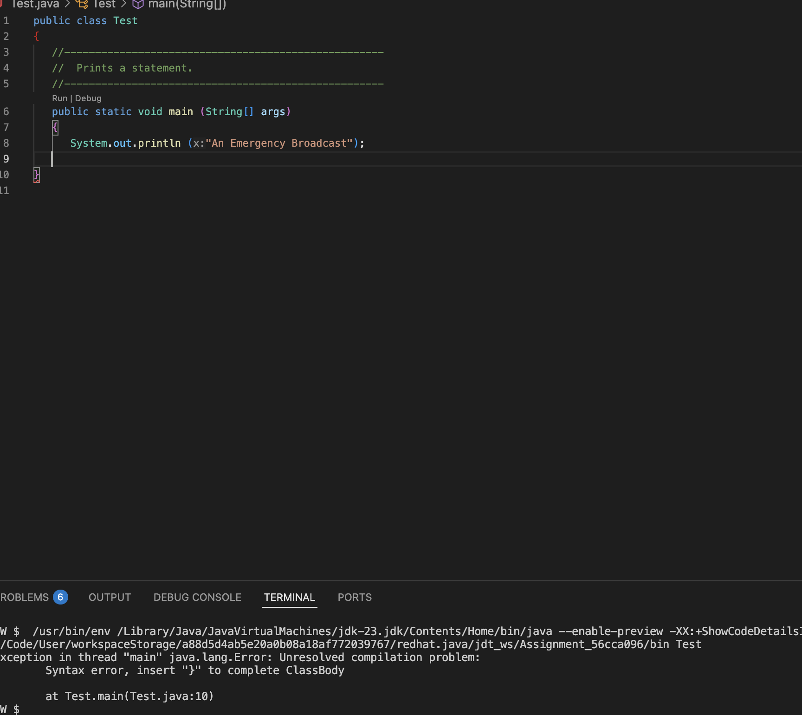

# 1 Getting Started

**to be committed by 10th February**

1 Hello World        ${\color{green}-- todo}$\
2 Test               ${\color{green}-- todo}$\
3 Personal Details   ${\color{green}-- todo}$\
4 Diamonds           ${\color{green}-- todo}$\
5 Questions          ${\color{green}-- todo}$

Please replace ${\color{green}-- todo}$ with ${\color{blue}-- completed}$ once done.

---

For each question in the exercise, please either display the output generated by running the program, or the answer if the task is a question.

1 -

--- Hello World 

2 -

--- a. Exception in thread "main" java.lang.Error: Unresolved compilation problem: at test.main(Test.java:6) 
--- b. An emergency Broadcast [B](qn2_b.png)
--- c. Remove the first quotation mark in the string.\ : Exception in thread "main" java.lang.Error: Unresolved compilation problems: [C](qn2_c.png)
        Syntax error, insert ")" to complete MethodInvocation
        Syntax error, insert ";" to complete BlockStatements
        An cannot be resolved to a variable
        Emergency cannot be resolved to a type
        Syntax error, insert ";" to complete LocalVariableDeclarationStatement
        String literal is not properly closed by a double-quote
        String literal is not properly closed by a double-quote
--- d. Error: Main method not found in class Test, please define the main method as: [D](qn2_d.png)
   public static void main(String[] args)
--- e. The method bogus(String) is undefined for the type PrintStream
       at Test.main(Test.java:8)[E](qn2_e.png)
--- f.  Syntax error, insert ";" to complete BlockStatements 
     at Test.main(Test.java:8)  [F](qn2_f.png)
--- g. Exception in thread "main" java.lang.Error: Unresolved compilation problem: 
        at Test.main(Test.java:7 ) 
3 -
--- Personal Details: [Personal Details](qn3_personal_details.png)
    Name: Subekshya Timalsina
    Address: Kathmandu, Nepal
    Gender: Female
    Phone Number: +977 9702628568
    Email: subekshyatimalsina@gmail.com

4 -

--- WorkspaceStorage/a88d5d4ab5e20a0b08a18af772039767/redhat.java/jdt_ws/Assignment_56cca096/bin DiamondShape  [Diamond Output](qn4.png)
   *
  ***
 *****
*******
 *****
  ***

5 -
--- a. java version "23.0.2" 2025-01-21 [Java_Version](qn4_a.png)
--- b. Java SE is used for developing desktop, web, and enterprise applications. It provides a complete set of libraries and features for general-purpose programming.
       Java ME is a lightweight version of Java, designed for mobile devices, embedded systems, and IoT applications. It has a smaller set of libraries to run efficiently on low-powered hardware.
--- c. OS that support Java
       1. Windows
       2. macOS
       3. Linux
       4. Solaris
       5. Android (via Android SDK)
       6. Embedded systems (via Java ME)
--- d. IntelliJ IDEA is the most popular
--- e. The main() function is the starting point of every Java application. It tells the Java Virtual Machine (JVM) where to begin executing the program.

